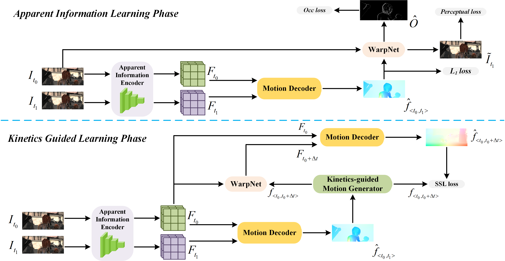

# Rethink Predicting the Optical Flow with the Kinetics Perspective

This repository is the official implementation of [Rethink Predicting the Optical Flow with the Kinetics Perspective](assets/paper/2753_rethink_predicting_the_optical_flow_with_the_kinetics_perspective.pdf). 

>📋


## ✓ Code Completeness Checklist
- [x] [Specification of dependencies](#requirements)
- [x] [Training code](scripts/train.sh)
- [x] [Evaluation code](scripts/evaluate.sh)
- [x] [Pre-trained models](ckpts/)
- [x] README files including table of [results](#results) accompanied by [precise commands](scripts/) to run/produce those results

## Requirements

To install requirements (python=3.8):

```setup
conda create -n kinetics_flow python=3.8
conda install pytorch==1.13.0 torchvision==0.14.0 torchaudio==0.13.0 cudatoolkit=11.7 -c pytorch -c nvidia
pip install -r requirements.txt
```

## Structure of Dataset
```
├── datasets
    ├── FlyingChairs_release
        ├── data
        └── chairs_split.txt
    ├── FlyingThings3D
        ├── frames_cleanpass
        ├── frames_finalpass
        └── optical_flow
    ├── Sintel
        ├── training
        └── test
    ├── HD1K
        ├── hd1k_input
        └── hd1k_flow_gt
    ├── KITTI
        ├── training
        └── testing
    ├── high_speed_sintel
        ├── clean_1008fps
        ├── flow_1008fps
        └── occlusions_fps
    ├── DAVIS
        └── JPEGImages
```
Here are the corresponding links for each dataset, and you need to download, unzip, and **rename the dataset folder as given above**:
- FlyingChairs_release: FlyingChairs dataset, [download link](https://lmb.informatik.uni-freiburg.de/data/FlyingChairs/FlyingChairs.zip)
- FlyingThings3D: FlyingThings3D dataset, [download link](https://lmb.informatik.uni-freiburg.de/resources/datasets/SceneFlowDatasets.en.html)
- Sintel: MPI Sintel dataset, [download link](http://sintel.is.tue.mpg.de/downloads)
- KITTI: KITTI-2015 dataset, [download link](https://www.cvlibs.net/datasets/kitti/eval_scene_flow.php?benchmark=flow)
- HD1K: HD1K dataset, [download link](http://hci-benchmark.iwr.uni-heidelberg.de/)
- HighSpeedSintel: High-Speed Sintel dataset, [download link](https://www.cvlibs.net/projects/slow_flow/)
- DAVIS: DAVIS 2017 dataset, [download link](https://davischallenge.org/davis2017/code.html#unsupervised)

We provide a simple script to create symbolic links to link local datasets (provided the names of local datasets are the same as above structure). You can change the `$LOCAL_ROOT_PATH` variable in [script](scripts/link_datasets.sh) to your local root directory of all optical flow datasets or set the value by command line.
```bash
bash scripts/link_dataset.sh [${LOCAL_ROOT_PATH}]
```

For better comprehension of training pipeline, we declare the datasets used in each stage as following:

| Stage  | Dataset Name                     |
|--------|----------------------------------|
| [chairs](configs/chairs.yaml) | FlyingChairs                     |
| [things](configs/things.yaml) | FlyingThings3D                   |
| [sintel](configs/sintel.yaml) | FlyingThings3D+Sintel+KITTI+HD1K |
| [kitti](configs/kitti.yaml)   | KITTI                            |
| [ss](configs/ss.yaml)         | HighSpeedSintel+DAVIS            |


## Details about Our Framework

### Training
To train the model(s) in the paper, run:
```bash
bash scripts/train.sh 
```
Detailed hyperparameters are provided in the corresponding [configuration files](configs/)

### Evaluation
To evaluate our model on Sintel and KITTI training set, run:
```bash
bash scripts/evaluate.sh
```

### Ablations
[Ablation configurations](configs/ablations/) provide examples of ablations:
- without pretrained GIM
- without WarpNet

### Pre-trained Models

You can download pretrained models here:
- [Models](ckpts/) with name suffix representing trained for evaluating corresponding dataset. 
- You can download [VGG19](https://download.pytorch.org/models/vgg19-dcbb9e9d.pth) from pytorch.
- You can download [LoFTR outdoor](http://cmp.felk.cvut.cz/~mishkdmy/models/loftr_outdoor.ckpt) model from kornia.
>📋  Give a link to where/how the pretrained models can be downloaded and how they were trained (if applicable).  Alternatively you can have an additional column in your results table with a link to the models.

### Results
Our final model achieves the following performance on Sintel(train set) and KITTI-2015, details on the paper:
|        | Sintel(train/clean, EPE) | Sintel(train/final, EPE) | KITTI-15(train, Fl-all) | KITTI-15(test, Fl-all) |
|--------|--------------------------|--------------------------|-------------------------|------------------------|
| [Ours](https://github.com/YuhaoCheng/KineticsOpticalFlow)   | **0.50**                     | **0.87**                     | 1.23                    | **4.94**                   |
| [RAFT](https://github.com/princeton-vl/RAFT)   | 0.77                     | 1.22                     | 1.52                    | 5.04                   |
| [GMA](https://github.com/zacjiang/GMA)    | 0.62                     | 1.06                     | **1.22**                    | 5.15                      |
| [GMFlow](https://github.com/haofeixu/gmflow) | 0.76                     | 1.11                     | 5.17                    | 9.32                   |


## Citation
If you found our paper helpful to your research, please consider citing:
```bibtex
@inproceedings{cheng_kinetics_2024,
    title={Rethink Predicting the Optical Flow with the Kinetics Perspective},
    author={Cheng, Yuhao and Zhang, Siru and Yan, Yiqiang},    
    year={2024}
}
```

## Acknowledgments
- [MatchFlow](https://github.com/DQiaole/MatchFlow)
- [GMFlow](https://github.com/haofeixu/gmflow)
- [SCV](https://github.com/zacjiang/SCV)
- [LoFTR](https://github.com/zju3dv/LoFTR)